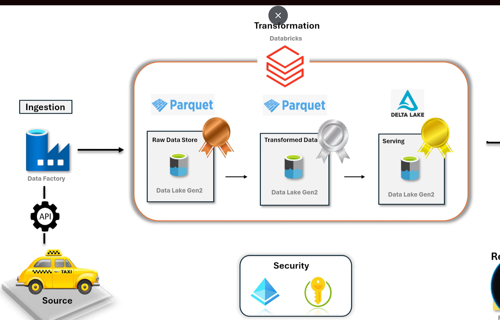

# 🚕 NYC Green Taxi End-to-End Data Engineering Pipeline

## 📌 Project Overview
This project demonstrates an **end-to-end data engineering pipeline** built using **Azure Data Factory, Azure Data Lake Storage Gen2, and Azure Databricks**.

The pipeline ingests **NYC Green Taxi trip data** from a public data source, processes it using **PySpark transformations**, and stores the data following the **Medallion Architecture (Bronze, Silver, Gold)**.

The final serving layer is implemented using **Delta Lake**, enabling features such as:

- ACID transactions
- Data versioning
- Time travel
- Schema enforcement

This project simulates a **real-world batch data pipeline used in Lakehouse architectures**.

---

# 🏗️ Architecture

The project follows a **Lakehouse architecture with Medallion layers**.

Source (NYC Taxi Dataset)  
↓  
Azure Data Factory (Data Ingestion)  
↓  
Azure Data Lake Storage Gen2  
↓  
Bronze Layer (Raw Data - Parquet)  
↓  
Azure Databricks (PySpark Transformations)  
↓  
Silver Layer (Clean Data - Parquet)  
↓  
Gold Layer (Serving Layer - Delta Tables)  
↓  
Analytics / BI Tools

---

# 🛠️ Tech Stack

| Technology | Purpose |
|------------|--------|
| Azure Data Factory | Data ingestion pipeline |
| Azure Data Lake Storage Gen2 | Data storage |
| Azure Databricks | Data processing |
| PySpark | Data transformation |
| Delta Lake | Gold serving layer |
| Parquet | Storage format |
| Azure Active Directory | Secure authentication |

---

# 📂 Dataset

Dataset: **NYC Green Taxi Trip Data**

Source:  
https://www.nyc.gov/site/tlc/about/tlc-trip-record-data.page

The dataset includes:

- Pickup and drop-off locations
- Trip distance
- Fare amount
- Payment type
- Trip type

This project processes **one year of historical taxi trip data** to simulate a real-world batch data pipeline.

---

# 🧱 Medallion Architecture

## 🥉 Bronze Layer (Raw Data)

The Bronze layer stores **raw ingested data directly from the source**.

Characteristics:

- Raw ingestion from NYC dataset
- Stored in **Parquet format**
- Maintains original schema
- Used as the source of truth

Example structure:

bronze/
   trips2025data/
   trip_zone/
   trip_type/

---

## 🥈 Silver Layer (Clean Data)

The Silver layer contains **cleaned and transformed datasets**.

Transformations performed:

- Schema enforcement
- Column selection
- Feature engineering
- Data normalization
- Splitting zone fields
- Extracting trip date, year, and month

Example transformation:

df_trip = df_trip.withColumn("trip_date", to_date("lpep_pickup_datetime")) \
.withColumn("trip_year", year("lpep_pickup_datetime")) \
.withColumn("trip_month", month("lpep_pickup_datetime"))

---

## 🥇 Gold Layer (Serving Layer)

The Gold layer contains **analytics-ready tables stored using Delta Lake**.

Tables created:

gold.trip_zone  
gold.trip_type  
gold.trip_trip  

Benefits of Delta Lake:

- ACID transactions
- Version history
- Time travel
- Schema enforcement

---
# 🔄 Data Pipeline

## Data Ingestion (Azure Data Factory)

The data ingestion layer of this project is implemented using **Azure Data Factory (ADF)** to automatically extract NYC Green Taxi trip data from a public HTTP source and load it into **Azure Data Lake Storage Gen2 (Bronze Layer)**.

The pipeline was initially designed to ingest a **single month's dataset**, but it was later enhanced using **dynamic parameterization and control flow activities** to ingest an entire year's dataset automatically.

---

## Linked Services

Two linked services were created in Azure Data Factory:

• **HTTP Linked Service** – connects to the NYC Taxi public dataset website  
• **Azure Data Lake Storage Gen2 Linked Service** – used as the destination storage  

These linked services enable the pipeline to securely extract data from the public dataset and load it into the Data Lake.

---

## Parameterized Dataset

To make the pipeline reusable, a parameter called **p_month** was created.

This parameter dynamically updates the dataset URL for different months.

Example dataset naming pattern:

green_tripdata_2025_01.parquet  
green_tripdata_2025_02.parquet  
green_tripdata_2025_03.parquet  
...  
green_tripdata_2025_12.parquet  

This allows the pipeline to dynamically pull datasets for multiple months.

---

## ForEach Activity

A **ForEach activity** was implemented to iterate through all months of the year.

Expression used:

@range(1,12)

This generates a list of numbers from **1 to 12**, representing all months.

Each iteration processes a specific month's dataset automatically.

---

## Handling Dataset Naming Format (If Condition)

The NYC Taxi dataset uses **two different naming conventions** for months.

Months **January – September** use a leading zero:

green_tripdata_2025_01.parquet  
green_tripdata_2025_02.parquet  
...  
green_tripdata_2025_09.parquet  

Months **October – December** do not require a leading zero:

green_tripdata_2025_10.parquet  
green_tripdata_2025_11.parquet  
green_tripdata_2025_12.parquet  

To handle this difference, an **If Condition activity** was implemented.

Expression used:

@greater(@item(),9)

Logic:

• If **month > 9** → dataset format is **10–12**  
• If **month ≤ 9** → dataset format is **01–09**

This ensures the pipeline dynamically generates the correct dataset name.

---

## Copy Activity

Inside the **ForEach loop**, a **Copy Activity** is triggered.

The Copy Activity performs the following steps:

1. Reads Parquet files from the **HTTP source**
2. Dynamically builds the dataset path using the **month parameter**
3. Loads the dataset into the **Bronze layer in Azure Data Lake Storage Gen2**

Example destination path:

bronze/trips2025data/

---

## Final Pipeline Workflow

ForEach (Months 1–12)  
↓  
If Condition (Handle dataset naming format)  
↓  
Copy Activity  
↓  
Load raw data into Bronze Layer

---

## Result

The pipeline dynamically ingests **12 months of NYC Green Taxi data** from the public source into the Bronze layer.

Key advantages of this approach:

• Automated ingestion pipeline  
• Dynamic parameterization for scalability  
• Proper handling of dataset naming formats  
• No manual ingestion required  

This design simulates a **real-world batch ingestion pipeline used in modern data engineering architectures**..

# ⚙️ Data Processing (Azure Databricks)

Azure Databricks performs data transformation tasks.

Processing steps:

1. Connect to ADLS Gen2 using **Service Principal authentication**
2. Read raw data from Bronze layer
3. Perform transformations using **PySpark**
4. Write cleaned datasets to Silver layer
5. Create Delta tables in the Gold layer

---

# 🧪 Delta Lake Features Demonstrated

### Version History

DESCRIBE HISTORY gold.trip_zone

Tracks table operations and version history.

---

### Update Operation

UPDATE gold.trip_zone  
SET Borough = 'EWR'  
WHERE LocationID = 1

---

### Delete Operation

DELETE FROM gold.trip_zone  
WHERE LocationID = 1

---

### Time Travel

RESTORE gold.trip_zone TO VERSION AS OF 0

This allows recovery of previous table versions.

---

# 🔐 Security

Secure data access is implemented using **Azure Active Directory Service Principal authentication**.

Configuration includes:

- Client ID
- Client Secret
- Directory ID

Spark OAuth configuration is used to authenticate Databricks with ADLS Gen2.

---

# 📁 Project Structure

nyc-taxi-data-engineering/

│  
├── notebooks/  
│   ├── bronze_ingestion  
│   ├── silver_transformation  
│   └── gold_layer  
│  
├── architecture/  
│   └── architecture_diagram.png  
│  
├── pipelines/  
│   └── adf_pipeline_screenshots  
│  
└── README.md  

---

# 📚 Key Learnings

This project demonstrates:

- End-to-end data pipeline design
- Medallion architecture implementation
- Azure Data Factory pipeline automation
- PySpark data transformations
- Secure cloud data access
- Delta Lake advanced features

---

# 🚀 Future Improvements

Potential improvements include:

- Incremental data ingestion
- Data quality validation checks
- Partitioning strategies
- Pipeline monitoring and alerting
- Integration with Power BI dashboards

---

# 👨‍💻 Author

Sriram Mahesh Babu  

Aspiring Data Engineer passionate about building scalable cloud data pipelines.

GitHub  
https://github.com/Mahesh200457

LinkedIn  
https://www.linkedin.com/in/sriram-mahesh-babu
